# AI Business Assistant — Atelier Prompt Engineering

Ce dépôt présente la réalisation de l'atelier Prompt Engineering : 
construction, test et évaluation de prompts pour un assistant IA métier.

## Partie 1 — Anatomie d'un prompt

**Objectif :** analyser les retours clients d'une entreprise.

### Prompt construit

*Rôle : Tu es un analyste customer insights expérimenté.

Contexte : Une entreprise de e-commerce reçoit régulièrement des avis clients
suite à ses livraisons et son service client.

Tâche : Analyse les avis clients ci-dessous et identifie les tendances 
principales (points positifs récurrents, problèmes récurrents).

Données d'entrée :
"""
1. "Livraison rapide mais l'emballage était abîmé."
2. "Service client très réactif, problème résolu en 10 minutes."
3. "J'ai attendu 3 jours de plus que prévu, aucune communication."
4. "Produit conforme à la description, très satisfait."
5. "Application qui plante souvent au moment du paiement."
"""

Contraintes : Base-toi uniquement sur les avis fournis, ne pas inventer 
d'informations non mentionnées, rester factuel.

Format de sortie : 
- Liste des points positifs récurrents
- Liste des problèmes récurrents
- Une recommandation générale en une phrase*

### Réponse obtenue

### Analyse

Le LLM a respecté l'ensemble des contraintes du prompt : chaque point cité 
(positif ou négatif) est directement rattaché à un avis précis, sans 
information inventée. Le format demandé (points positifs / problèmes / 
recommandation) est bien suivi. Point notable : le LLM a spontanément 
ajouté une remarque méthodologique sur la faible représentativité 
statistique de l'échantillon (5 avis), ce qui n'était pas explicitement 
demandé mais montre une bonne prise de recul sur la fiabilité de l'analyse.

## Partie 2 — Comparer les techniques de prompting

### 2.1 Zero-shot

**Prompt :**
Classe le commentaire suivant en positif, négatif ou neutre :
"Le service est rapide mais l'application plante régulièrement."

**Réponse obtenue :**

### Analyse 

Le LLM hésite entre deux classes : il propose d'abord "neutre/mitigé" 
(catégorie non prévue dans les 3 classes demandées), avant de préciser 
que s'il doit choisir strictement parmi positif/négatif/neutre, il 
pencherait pour "négatif". Le prompt zero-shot n'imposant aucune 
contrainte de format, le LLM se permet de sortir du cadre des 3 classes 
demandées.

### 2.2 One-shot

**Prompt :**
Voici un exemple de classification :
Commentaire : "Livraison en retard, produit endommagé."
Classe : négatif

Classe maintenant ce commentaire en positif, négatif ou neutre :
"Le service est rapide mais l'application plante régulièrement."

**Réponse obtenue :**

### Analyse

Contrairement au zero-shot qui hésitait entre "neutre/mitigé" et "négatif", 
l'ajout d'un seul exemple suffit à faire trancher le LLM de façon nette 
pour "négatif", en respectant strictement les 3 classes demandées. 
L'exemple fourni (qui associe un problème concret à la classe "négatif") 
semble avoir cadré le format de réponse attendu.

### 2.3 Few-shot

**Prompt :**
Voici des exemples de classification :
Commentaire : "Livraison en retard, produit endommagé." → négatif
Commentaire : "Très satisfait, produit conforme et rapide." → positif
Commentaire : "Produit reçu, rien de particulier à signaler." → neutre

Classe maintenant ce commentaire en positif, négatif ou neutre :
"Le service est rapide mais l'application plante régulièrement."

**Réponse obtenue :**

### Analyse

Le few-shot confirme le résultat du one-shot ("négatif"), avec une 
justification quasi identique. L'ajout de deux exemples supplémentaires 
(dont un cas "neutre" et un cas "positif") n'a pas fait varier le résultat 
ni significativement enrichi le raisonnement par rapport au one-shot, ce 
qui suggère qu'un seul exemple bien choisi suffisait déjà à cadrer la 
réponse pour cette tâche de classification simple.

### 2.4 Prompt structuré

**Prompt :**
Rôle : Tu es un système de classification de sentiment client.

Contexte : Une entreprise analyse les commentaires clients pour détecter 
les avis mitigés (contenant à la fois du positif et du négatif).

Tâche : Classe le commentaire suivant en une seule classe parmi : 
positif, négatif, neutre.

Commentaire : "Le service est rapide mais l'application plante régulièrement."

Contraintes : Si le commentaire contient à la fois un point positif et 
un point négatif, choisis la classe qui reflète l'impact principal sur 
l'expérience utilisateur. Justifie brièvement ton choix.

Format de sortie : 
Classe : [positif/négatif/neutre]
Justification : [une phrase]

**Réponse obtenue :**

### Analyse 

Le prompt structuré confirme "négatif", avec une justification similaire 
aux deux techniques précédentes, mais cette fois le format de sortie est 
strictement respecté ("Classe : ..." / "Justification : ..."), ce qui 
facilite l'exploitation automatique de la réponse par une application.

### 2.5 Comparaison des 4 techniques

| Technique | Classe obtenue | Respect du format demandé | Qualité de justification |
|---|---|---|---|
| Zero-shot | Hésite entre "neutre/mitigé" et "négatif" | Non (sort du cadre des 3 classes) | Bonne, mais réponse ambiguë |
| One-shot | Négatif | Oui | Nette et directe |
| Few-shot | Négatif | Oui | Similaire au one-shot |
| Prompt structuré | Négatif | Oui, format strict respecté | Nette, format exploitable |

**Conclusion :** le zero-shot est la seule technique à ne pas trancher 
clairement et à sortir du cadre des classes demandées. Dès qu'un exemple 
est fourni (one-shot), le LLM se stabilise sur "négatif" et respecte le 
format — ajouter plus d'exemples (few-shot) n'apporte pas de gain 
supplémentaire sur ce cas précis. Le prompt structuré est le plus fiable 
pour un usage en production, car il impose un format de sortie exploitable 
directement par une application, sans avoir besoin d'exemples.

## Partie 3 — Prompt Engineering et raisonnement

### 3.1 Décomposition du prompt (prompt chaining)

**Prompt initial à décomposer :**
"Analyse ces avis clients et donne-moi les problèmes les plus importants 
ainsi que les recommandations."

Cette tâche complexe est décomposée en 4 prompts séparés et enchaînés, 
où la réponse de chaque étape sert d'entrée à la suivante.

#### Étape 1/4 — Identifier les problèmes

**Prompt :**
Voici des avis clients :
"""
1. "Livraison rapide mais l'emballage était abîmé."
2. "Service client très réactif, problème résolu en 10 minutes."
3. "J'ai attendu 3 jours de plus que prévu, aucune communication."
4. "Produit conforme à la description, très satisfait."
5. "Application qui plante souvent au moment du paiement."
"""
Liste uniquement les problèmes mentionnés (sans les prioriser).

**Réponse obtenue :**

Le LLM identifie 4 problèmes distincts, en séparant même le retard de 
livraison et l'absence de communication (avis 3) en deux problèmes 
séparés, ce qui donne une granularité utile pour la suite de l'analyse.

#### Étape 2/4 — Évaluer l'importance

**Prompt :**
Voici une liste de problèmes identifiés dans des avis clients :
1. Emballage abîmé à la livraison
2. Retard de livraison de 3 jours par rapport au délai annoncé
3. Absence de communication concernant ce retard
4. Plantages fréquents de l'application au moment du paiement

Pour chaque problème, évalue son importance (fréquence d'apparition dans 
les avis, impact potentiel sur l'expérience client).

**Réponse obtenue :**

Le LLM évalue chaque problème selon son impact (critique / élevée / 
moyenne à élevée / moyenne) et propose une priorité de traitement. Point 
notable : il signale de lui-même une limite méthodologique (absence de 
données réelles de fréquence dans les avis fournis) et propose une piste 
d'amélioration (croiser fréquence réelle et gravité via une matrice 
impact/fréquence) — une forme de transparence utile sur la fiabilité de 
son évaluation.

#### Étape 3/4 — Prioriser

**Prompt :**
Voici des problèmes avec leur évaluation d'importance :
1. Plantages fréquents de l'application au moment du paiement — Critique
2. Absence de communication concernant le retard — Élevée
3. Retard de livraison de 3 jours — Moyenne à élevée
4. Emballage abîmé à la livraison — Moyenne

Classe ces problèmes du plus important au moins important.

**Réponse obtenue :**

Le LLM confirme le classement déjà induit par les niveaux d'importance 
de l'étape précédente (Critique > Élevée > Moyenne à élevée > Moyenne), 
sans changement d'ordre. Cette étape valide la cohérence du raisonnement 
plutôt que d'apporter une nouvelle analyse.

#### Étape 4/4 — Recommander

**Prompt :**
Voici des problèmes clients classés par importance :
1. Plantages fréquents de l'application au moment du paiement — Critique
2. Absence de communication concernant le retard — Élevée
3. Retard de livraison de 3 jours — Moyenne à élevée
4. Emballage abîmé à la livraison — Moyenne

Pour chaque problème important, propose une recommandation concrète et actionnable.

**Réponse obtenue :**

Le LLM propose des recommandations concrètes et actionnables pour chaque 
problème (outils de monitoring, automatisations, indicateurs chiffrés à 
suivre), avec un niveau de détail cohérent avec le niveau de gravité 
(ex : objectif chiffré de taux d'échec pour le problème critique, 
suggestions plus légères pour l'emballage). Il propose même une 
prochaine étape (mise en forme en plan d'action), montrant une bonne 
compréhension de l'usage métier final de cette analyse.

### Bilan de la décomposition (3.1)

Décomposer la tâche en 4 prompts enchaînés permet d'obtenir, à chaque 
étape, une réponse plus ciblée et plus facile à vérifier qu'un unique 
prompt global. Chaque étape s'appuie explicitement sur la précédente, 
ce qui rend le raisonnement traçable et permet de détecter une éventuelle 
erreur avant qu'elle ne se propage aux étapes suivantes (contrairement à 
un prompt unique où toute la logique reste "boîte noire").

### 3.2 Self-check / vérification

**Prompt 1 — Analyse initiale :**
Voici un avis client :
"J'ai commandé un aspirateur robot le 3 mars. Il a mis 10 jours à arriver 
alors que le site annonçait 3 jours. Une fois reçu, il fonctionnait bien 
mais s'est arrêté de charger après une semaine. Le service client m'a 
proposé un remboursement partiel de 20%."

Contraintes : Base-toi uniquement sur les informations présentes dans cet 
avis, ne rajoute aucune information non mentionnée.

Tâche : Résume cet avis en identifiant le problème principal, la cause 
probable et l'action déjà entreprise par l'entreprise.

**Réponse obtenue :**

Le LLM identifie correctement les deux problèmes (retard + panne) et 
l'action de l'entreprise (remboursement 20%). Point notable : concernant 
la "cause probable" demandée, il précise honnêtement que l'avis ne 
mentionne aucune cause, plutôt que d'en inventer une — bon respect de la 
contrainte de ne pas ajouter d'information non présente dans le texte.

**Prompt 2 — Vérification (self-check) :**
Vérifie ta réponse précédente en répondant précisément aux points suivants :

1. Contiens-tu des informations non justifiées par l'avis client d'origine ?
2. Y a-t-il des contradictions dans ta réponse ?
3. As-tu omis des informations importantes présentes dans l'avis ?
4. As-tu halluciné une information qui n'était pas dans le texte d'origine ?
5. As-tu bien respecté la contrainte de ne pas ajouter d'information non mentionnée ?

Réponds point par point, en citant précisément ce qui pose problème s'il y en a.

**Réponse obtenue :**

Le self-check révèle deux imperfections réelles dans la réponse initiale :
- une **extrapolation non justifiée** : "après une semaine" transformé en 
  "après une semaine d'utilisation", alors que l'avis ne précise pas s'il 
  s'agit d'usage effectif
- une **omission factuelle** : le fait que le produit "fonctionnait bien" 
  à la réception n'a pas été repris, rendant le résumé plus négatif que 
  l'avis d'origine

Le LLM ne détecte en revanche aucune contradiction interne ni hallucination 
franche, et corrige lui-même son résumé initial en conséquence.

### Bilan du self-check (3.2)

Cette technique permet de détecter des micro-distorsions qu'un simple 
relecture pourrait manquer (l'ajout du mot "d'utilisation" est subtil mais 
change le sens). Le second prompt agit comme un filtre de qualité qui 
améliore la fiabilité de la réponse finale, sans intervention humaine 
entre les deux étapes.

## Partie 4 — Sorties structurées

### 4.1 Génération d'une sortie JSON

**Prompt :**
Rôle : Tu es un système d'analyse de sentiment pour un service client.

Contexte : Voici un commentaire client à analyser :
"Le service est rapide mais l'application plante régulièrement au moment 
du paiement, c'est vraiment frustrant."

Tâche : Analyse ce commentaire et retourne le résultat au format JSON avec 
exactement les champs suivants :
- sentiment : chaîne de caractères, valeur parmi "positif", "negatif", "neutre"
- categorie : chaîne de caractères décrivant le sujet principal du commentaire 
  (ex : "livraison", "paiement", "produit", "service_client")
- urgence : chaîne de caractères, valeur parmi "faible", "moyenne", "elevee"
- probleme : chaîne de caractères décrivant le problème principal identifié
- confiance : nombre décimal entre 0 et 1 représentant ton niveau de confiance 
  dans cette classification

Contraintes : Retourne UNIQUEMENT le JSON, sans texte avant ou après, sans 
balises de code.

Format de sortie attendu (exemple) :
{
  "sentiment": "negatif",
  "categorie": "livraison",
  "urgence": "moyenne",
  "probleme": "Retard de livraison",
  "confiance": 0.91
}

**Réponse obtenue :**

Le LLM retourne un JSON valide et directement exploitable, respectant 
strictement les 5 champs demandés, sans texte parasite avant/après. Les 
valeurs sont cohérentes avec le commentaire : "negatif" et "elevee" sont 
justifiés par le terme "frustrant" et la nature bloquante du problème 
(paiement), avec un score de confiance élevé (0.93).

### 4.2 Validation des règles de sortie

**Prompt :**
Rôle : Tu es un système d'analyse de sentiment pour un service client.

Contexte : Voici un commentaire client à analyser :
"Le service est rapide mais l'application plante régulièrement au moment 
du paiement, c'est vraiment frustrant."

Tâche : Analyse ce commentaire et retourne le résultat au format JSON.

Règles de validation strictes à respecter impérativement :
- Le JSON doit être valide (syntaxe correcte, aucune erreur de parsing)
- Aucune propriété supplémentaire en dehors de : sentiment, categorie, 
  urgence, probleme, confiance
- "sentiment" doit valoir exactement "positif", "negatif" ou "neutre" 
  (aucune autre valeur autorisée)
- "urgence" doit valoir exactement "faible", "moyenne" ou "elevee"
- "confiance" doit être un nombre décimal strictement compris entre 0 et 1
- "categorie" et "probleme" doivent être des chaînes de caractères non vides

Contraintes : Retourne UNIQUEMENT le JSON final, sans texte avant ou après, 
sans balises de code markdown.

**Réponse obtenue :**

Le JSON produit respecte l'ensemble des règles de validation : syntaxe 
valide, exactement 5 propriétés (aucune superflue), "sentiment" et 
"urgence" utilisent des valeurs autorisées, "confiance" (0.85) est bien 
comprise entre 0 et 1. Le fait d'expliciter les règles de validation 
directement dans le prompt (plutôt que de les vérifier après coup) 
garantit une sortie exploitable sans post-traitement supplémentaire.

### Bilan de la Partie 4

Structurer la sortie en JSON, avec des règles de validation explicites 
dans le prompt, transforme une réponse en texte libre difficilement 
exploitable en une donnée directement utilisable par une application

## Partie 5 — Prompts pour les applications métier

### 5.1 Résumé de document

**Prompt :**
Rôle : Tu es un assistant de synthèse documentaire.

Contexte : Voici un rapport d'activité trimestriel à résumer :
"""
Au cours du dernier trimestre, l'équipe marketing avait pour objectif 
d'augmenter le trafic du site web de 15% et d'améliorer le taux de 
conversion des visiteurs en clients. Pour cela, une nouvelle campagne 
publicitaire a été lancée sur les réseaux sociaux, accompagnée d'une 
refonte de la page d'accueil du site. Les résultats montrent une hausse 
du trafic de 22%, dépassant l'objectif initial, mais le taux de conversion 
n'a progressé que de 2%, en dessous des attentes fixées à 5%. L'analyse 
des données suggère que le nouveau trafic provient majoritairement de 
visiteurs peu qualifiés, attirés par la campagne publicitaire mais peu 
intéressés par un achat immédiat. L'équipe recommande de mieux cibler 
les publicités sur des audiences à plus forte intention d'achat, et de 
simplifier le tunnel de paiement pour réduire l'abandon de panier lors 
du prochain trimestre.
"""

Tâche : Résume ce rapport.

Contraintes : 
- Maximum 250 mots
- Conserver uniquement les informations factuelles présentes dans le texte
- Identifier clairement : les objectifs, les résultats obtenus, les recommandations
- N'inventer aucune information non présente dans le texte

**Réponse obtenue :**

Le résumé respecte toutes les contraintes : structure claire en 4 sections 
(objectifs, actions, résultats, recommandations), aucune information 
inventée, longueur bien inférieure à la limite de 250 mots. Le LLM a même 
ajouté une section "Actions mises en œuvre" non explicitement demandée 
mais pertinente pour la clarté du résumé.

### 5.2 Traduction

**Prompt :**
Rôle : Tu es un traducteur professionnel spécialisé dans les documents 
d'entreprise.

Tâche : Traduis le texte suivant du français vers l'anglais.

Texte à traduire :
"""
La nouvelle version de notre plateforme intègre un système de 
recommandation basé sur l'intelligence artificielle. Ce système analyse 
le comportement de navigation de l'utilisateur en temps réel afin de lui 
proposer des produits pertinents. Les tests internes montrent une 
augmentation de 18% du taux de clic sur les recommandations par rapport 
à l'ancienne version basée sur des règles statiques.
"""

Contraintes :
- Conserver le sens exact du texte d'origine
- Conserver la structure du texte (même nombre de phrases/paragraphes)
- Conserver les termes techniques (ex : "taux de clic", "recommandation") 
  avec leur équivalent anglais standard
- Ne pas résumer le texte
- Ne rajouter aucune information absente du texte d'origine

**Réponse obtenue :**

La traduction respecte les contraintes : même nombre de phrases (3), sens 
identique, aucune information ajoutée ou omise. Le terme technique "taux 
de clic" est traduit par son équivalent anglais standard "click-through 
rate", plutôt qu'une traduction littérale, ce qui montre une bonne 
maîtrise terminologique plutôt qu'une traduction mot à mot.

### 5.3 Classification de ticket informatique

**Prompt :**
Rôle : Tu es un système de tri automatique de tickets informatiques.

Tâche : Classe le ticket suivant dans une catégorie parmi : réseau, 
logiciel, matériel, sécurité, accès, autre.

Ticket : "Impossible de me connecter à mon compte depuis ce matin, le 
mot de passe est refusé alors que je suis sûr qu'il est correct. J'ai 
aussi reçu un email disant qu'une tentative de connexion inhabituelle 
a été détectée depuis un autre pays."

Format de sortie : JSON avec les champs suivants uniquement :
- categorie : chaîne de caractères (une valeur parmi la liste donnée)
- justification : chaîne de caractères expliquant brièvement le choix

Contraintes : Retourne uniquement le JSON, sans texte avant ou après.

**Réponse obtenue :**

Le LLM classe le ticket en "sécurité" plutôt qu'en "accès", en identifiant 
correctement que la combinaison "mot de passe refusé + alerte de connexion 
inhabituelle" évoque une possible compromission du compte, et non un simple 
problème d'accès classique. JSON valide, respectant strictement les 2 
champs demandés.

### 5.4 Extraction d'informations depuis une facture

**Prompt :**
Rôle : Tu es un système d'extraction de données comptables.

Tâche : Extrais les informations suivantes de la facture ci-dessous : 
numero_facture, date, client, montant_ht, tva, montant_ttc.

Facture :
"""
FACTURE N° FA-2024-0587
Date : 15/03/2024
Client : Société Dupont & Fils
Montant HT : 1 200,00 €
TVA (20%) : 240,00 €
Montant TTC : 1 440,00 €
"""

Format de sortie : Retourne uniquement un JSON valide avec exactement 
ces 6 champs. Si une information est absente de la facture, utilise 
la valeur null (pas de texte, pas de chaîne vide).

**Réponse obtenue :**

Extraction complète et fidèle des 6 champs demandés, aucune information 
manquante dans cette facture donc aucun `null` nécessaire. Point 
d'amélioration possible : les montants sont retournés en chaîne de 
caractères avec le symbole "€" ("1 200,00 €") plutôt qu'en valeur 
numérique pure — un prompt plus strict pourrait préciser le format 
attendu (ex : nombre décimal sans symbole monétaire) si l'objectif est 
de réutiliser ces valeurs dans des calculs automatisés.

### 5.5 Rédaction d'email

**Prompt :**
Rôle : Tu es un rédacteur pour le service client d'une entreprise 
e-commerce.

Contexte : Une commande client a pris du retard.

Tâche : Rédige un email destiné à ce client.

Objectifs de l'email :
- Reconnaître le retard
- Présenter des excuses
- Expliquer la situation sans inventer de cause précise (le motif exact 
  du retard n'est pas connu)
- Proposer une solution (ex : geste commercial, suivi prioritaire)

Ton : professionnel, courtois et rassurant

Contraintes : 150 mots maximum

**Réponse obtenue :**

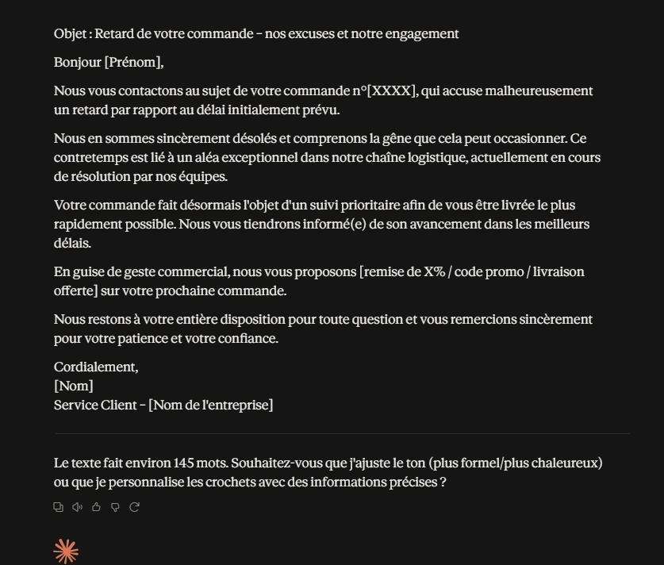

L'email respecte le ton demandé (professionnel, courtois, rassurant), la 
limite de mots (~145 mots) et propose bien une solution concrète (suivi 
prioritaire + geste commercial). Point de vigilance : la contrainte 
demandait explicitement de ne pas inventer de cause précise, or le LLM 
mentionne "un aléa exceptionnel dans notre chaîne logistique" — une 
cause qui reste vague, mais qui constitue tout de même une explication 
non fournie dans le prompt d'origine. Cela illustre une limite : même 
avec une contrainte explicite de ne pas inventer, le LLM a tendance à 
combler les vides pour rendre le texte plus naturel.

### Bilan de la Partie 5

Les 5 exercices confirment un principe commun : plus le prompt précise 
le rôle, le format et les contraintes, plus la réponse est directement 
exploitable (JSON valides et bien formés pour les tâches 3 et 4). 
Cependant, la tâche 5 montre une limite récurrente des LLM : même avec 
une contrainte explicite ("ne pas inventer"), le modèle peut légèrement 
s'en écarter pour produire un texte plus fluide, ce qui souligne 
l'importance de toujours relire une sortie générée avant utilisation, 
même lorsque le prompt est bien construit.

## Partie 6 — Prompt Engineering pour le Machine Learning

### 6.1 Stratégies de traitement des données

**Prompt :**
Rôle : Tu es un data scientist expérimenté.

Contexte : Dataset de capteurs IoT installés dans plusieurs bâtiments, 
605 lignes, colonnes : id_mesure, date_heure, id_capteur, batiment, 
temperature (float), humidite (float), pression (float), 
consommation (float), etat (catégorielle).

Voici un échantillon réel des données (5 lignes) :
id_mesure | date_heure          | id_capteur | batiment | temperature | humidite | pression | consommation | etat
M0413     | 2026-01-22 04:00:00 | C005       | B002     | 25.46       | 58.06    | 1008.95  | 287.28       | OK
M0290     | 2026-01-17 01:00:00 | C002       | B001     | 24.00       | 79.73    | 993.39   | 116.20       | OK
M0077     | 2026-01-08 04:00:00 | C005       | B002     | 25.82       | 54.47    | 1010.32  | 288.50       | OK
M0079     | 2026-01-08 06:00:00 | C007       | B003     | 28.23       | 69.39    | 1019.62  | 136.65       | OK
M0183     | 2026-01-12 14:00:00 | C003       | B001     | 20.58       | 53.80    | 1016.58  | 182.62       | OK

Tâche : Pour ce dataset, propose une stratégie complète concernant :
1. Les valeurs manquantes (comment les détecter, comment les traiter, 
   quels risques associés à chaque méthode)
2. Les doublons (comment les détecter, comment les traiter — attention, 
   plusieurs capteurs différents peuvent mesurer à la même date_heure, 
   ce n'est pas forcément un doublon)
3. Les valeurs aberrantes / outliers (comment les détecter, comment les 
   traiter, quels risques associés)
4. Les variables catégorielles/identifiants (comment traiter id_capteur, 
   batiment et etat pour un futur modèle ML)

Format de sortie : une section par point (1 à 4), avec pour chacune : 
méthode de détection, méthode de traitement recommandée, risques associés.

**Réponse obtenue :**

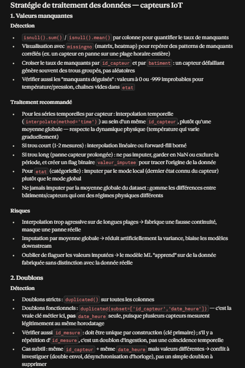
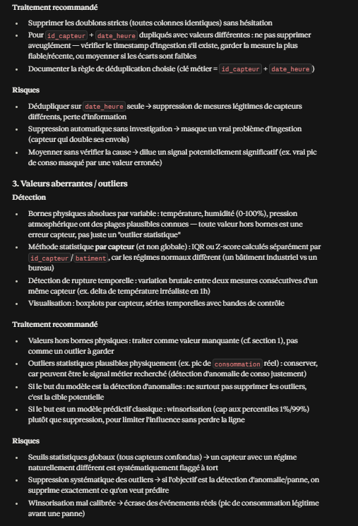
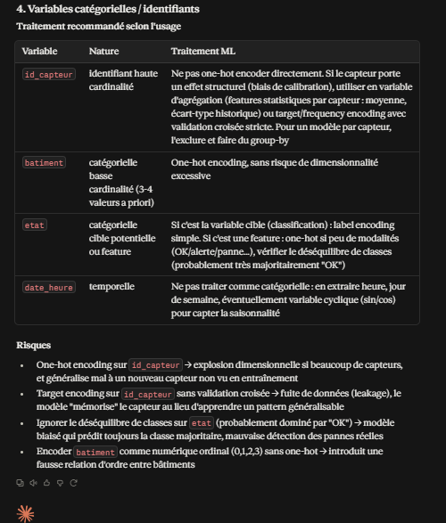

**Analyse :**

Réponse remarquablement adaptée au contexte réel du dataset, plutôt qu'une 
réponse générique de nettoyage de données :
- Détection des doublons fonctionnels sur `id_capteur` + `date_heure` 
  (et non `date_heure` seule), en tenant compte du fait que plusieurs 
  capteurs mesurent légitimement au même horodatage — exactement la 
  précision demandée dans le prompt
- Recommandation d'interpolation par capteur plutôt que par moyenne 
  globale, pour respecter les régimes physiques différents entre 
  bâtiments/capteurs
- Distinction entre outlier "erreur capteur" (hors bornes physiques) et 
  outlier "signal métier" (pic de consommation réel à ne pas supprimer 
  si l'objectif est la détection d'anomalies)
- Mise en garde sur le risque de fuite de données (data leakage) si 
  `id_capteur` est encodé par target encoding sans validation croisée

Ce niveau de détail illustre l'intérêt de fournir un contexte métier 
précis (plusieurs capteurs/bâtiments) et un échantillon réel : le LLM 
adapte ses recommandations à la structure effective des données plutôt 
que de donner des conseils de nettoyage génériques.

### 6.2 Visualisations pertinentes

**Prompt :**
Rôle : Tu es un data analyst expérimenté.

Contexte : Dataset de capteurs IoT (605 lignes), colonnes : id_mesure, 
date_heure, id_capteur, batiment, temperature, humidite, pression, 
consommation, etat.

Voici un échantillon réel des données (5 lignes) :
id_mesure | date_heure          | id_capteur | batiment | temperature | humidite | pression | consommation | etat
M0413     | 2026-01-22 04:00:00 | C005       | B002     | 25.46       | 58.06    | 1008.95  | 287.28       | OK
M0290     | 2026-01-17 01:00:00 | C002       | B001     | 24.00       | 79.73    | 993.39   | 116.20       | OK
M0077     | 2026-01-08 04:00:00 | C005       | B002     | 25.82       | 54.47    | 1010.32  | 288.50       | OK
M0079     | 2026-01-08 06:00:00 | C007       | B003     | 28.23       | 69.39    | 1019.62  | 136.65       | OK
M0183     | 2026-01-12 14:00:00 | C003       | B001     | 20.58       | 53.80    | 1016.58  | 182.62       | OK

Tâche : Propose les visualisations les plus pertinentes pour comprendre 
la consommation énergétique d'un bâtiment.

Format de sortie : pour chaque visualisation proposée, indique : le type 
de graphique, les variables utilisées, l'objectif, l'interprétation attendue.

**Réponse obtenue :**

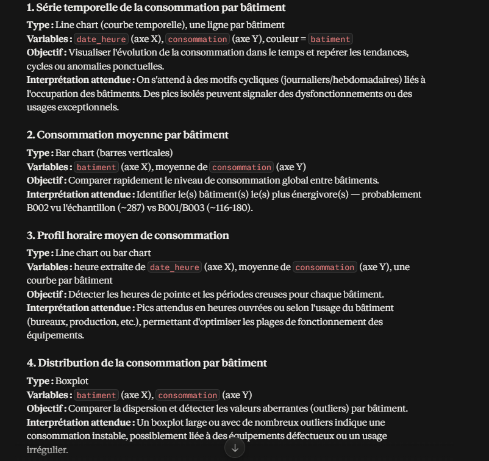
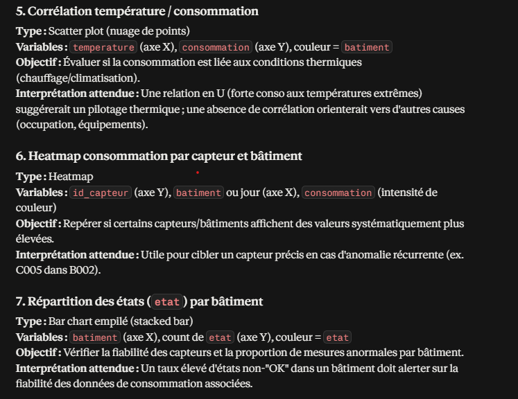

**Analyse :**

Le LLM propose 7 visualisations complémentaires plutôt qu'une seule, 
couvrant différents angles d'analyse : évolution temporelle, comparaison 
inter-bâtiments, profil horaire, distribution/outliers, corrélation avec 
la température, granularité par capteur, et fiabilité des données 
(via `etat`). Point notable : le LLM exploite l'échantillon fourni pour 
émettre une observation concrète ("B002 probablement le plus énergivore 
vu l'échantillon, ~287 vs ~116-180"), illustrant l'intérêt de fournir des 
données réelles plutôt qu'une description abstraite des colonnes. La 
dernière visualisation (répartition des états par bâtiment) est une 
proposition pertinente non demandée explicitement, mais utile pour 
qualifier la fiabilité des données avant toute analyse de consommation.

### 6.3 Sélection de modèles

**Prompt :**
Rôle : Tu es un expert en machine learning.

Contexte : Dataset de capteurs IoT (605 lignes), colonnes : id_mesure, 
date_heure, id_capteur, batiment, temperature, humidite, pression, 
consommation, etat.

Voici un échantillon réel des données (5 lignes) :
id_mesure | date_heure          | id_capteur | batiment | temperature | humidite | pression | consommation | etat
M0413     | 2026-01-22 04:00:00 | C005       | B002     | 25.46       | 58.06    | 1008.95  | 287.28       | OK
M0290     | 2026-01-17 01:00:00 | C002       | B001     | 24.00       | 79.73    | 993.39   | 116.20       | OK
M0077     | 2026-01-08 04:00:00 | C005       | B002     | 25.82       | 54.47    | 1010.32  | 288.50       | OK
M0079     | 2026-01-08 06:00:00 | C007       | B003     | 28.23       | 69.39    | 1019.62  | 136.65       | OK
M0183     | 2026-01-12 14:00:00 | C003       | B001     | 20.58       | 53.80    | 1016.58  | 182.62       | OK

Tâche : Propose plusieurs modèles adaptés à la prédiction de la 
consommation énergétique d'un bâtiment (variable cible : consommation, 
variable numérique continue).

Format de sortie : pour chaque modèle, indique : le principe, les 
avantages, les limites, le type de problème, les métriques pertinentes.

**Réponse obtenue :**

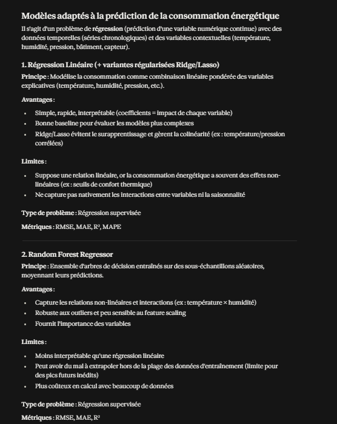
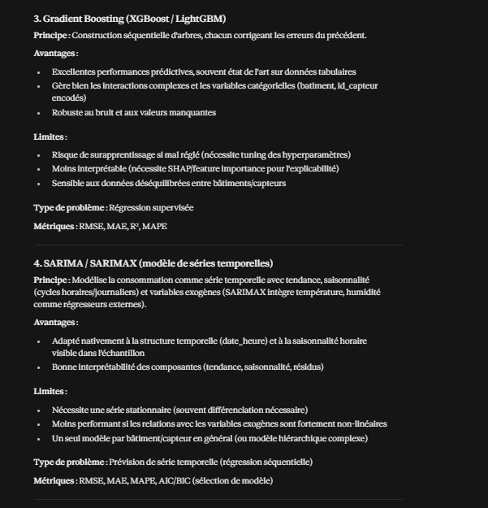
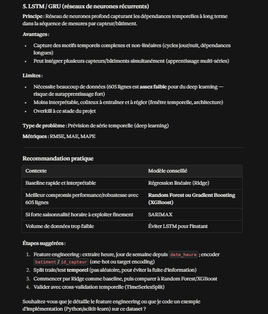

**Analyse :**

Le LLM identifie correctement le problème comme une régression sur série 
temporelle, et propose 5 modèles allant du plus simple (régression 
linéaire) au plus complexe (LSTM), avec pour chacun principe, avantages, 
limites et métriques adaptées. Point notable de rigueur : le LLM déconseille 
explicitement le LSTM compte tenu de la taille limitée du dataset (605 
lignes), plutôt que de recommander par défaut l'approche la plus avancée — 
signe d'une recommandation contextualisée plutôt que générique. Il rappelle 
également une bonne pratique essentielle pour ce type de données : un 
split train/test **temporel** (et non aléatoire) pour éviter la fuite 
d'information, ainsi qu'une validation croisée adaptée.

### 6.4 Métriques de classification

**Prompt :**
Rôle : Tu es un expert en machine learning, pédagogue.

Tâche : Explique les métriques de classification suivantes : Accuracy, 
Precision, Recall, F1-score, ROC-AUC.

Pour chacune, indique :
- La définition
- Comment l'interpréter
- Un exemple concret
- Dans quel contexte elle est particulièrement utile

**Réponse obtenue :**

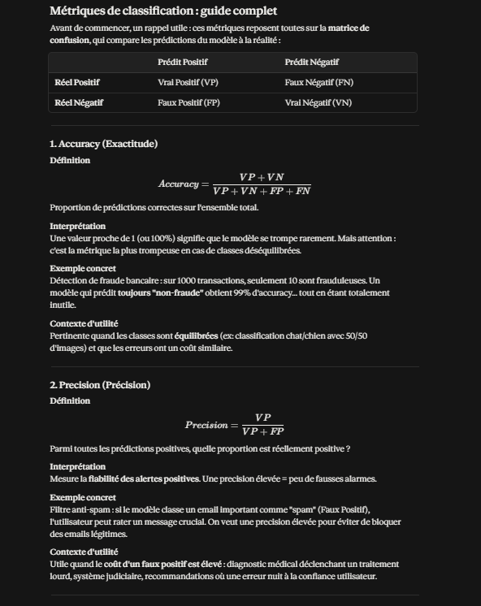
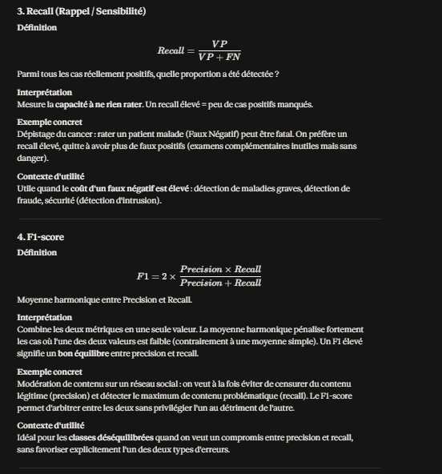
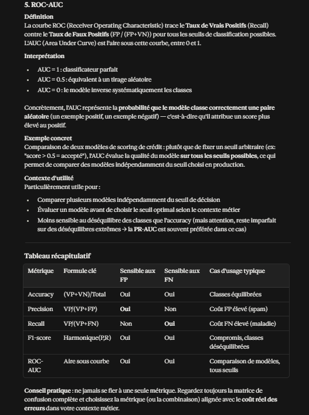

**Analyse :**

Réponse structurée et pédagogique : chaque métrique est accompagnée de sa 
formule, d'une interprétation claire et d'un exemple concret différent et 
bien choisi pour illustrer son usage (fraude bancaire pour l'accuracy, 
spam pour la precision, dépistage médical pour le recall, modération de 
contenu pour le F1-score, scoring de crédit pour le ROC-AUC). Le tableau 
récapitulatif final synthétise utilement la sensibilité de chaque métrique 
aux faux positifs/négatifs. Point notable : le LLM va au-delà de la 
demande en mentionnant la PR-AUC comme alternative préférable au ROC-AUC 
en cas de déséquilibre extrême des classes — une nuance technique 
pertinente mais non explicitement demandée.

### 6.5 Métriques de régression

**Prompt :**
Rôle : Tu es un expert en machine learning, pédagogue.

Tâche : Explique les métriques de régression suivantes : MAE, MSE, RMSE.

Pour chacune, indique :
- La définition
- Comment l'interpréter
- Un exemple concret
- Dans quel contexte elle est particulièrement utile

**Réponse obtenue :**

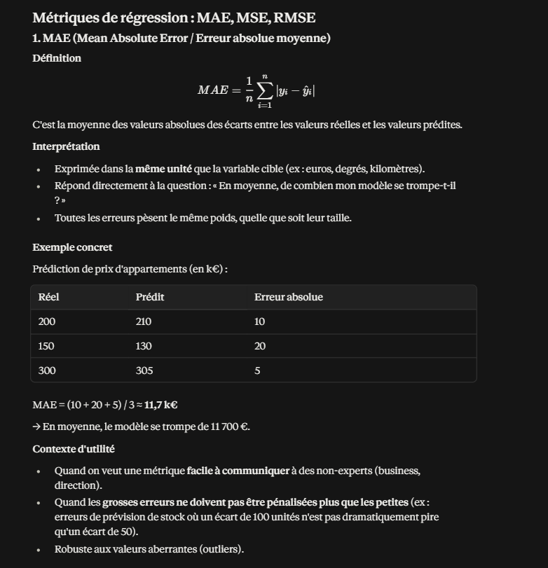
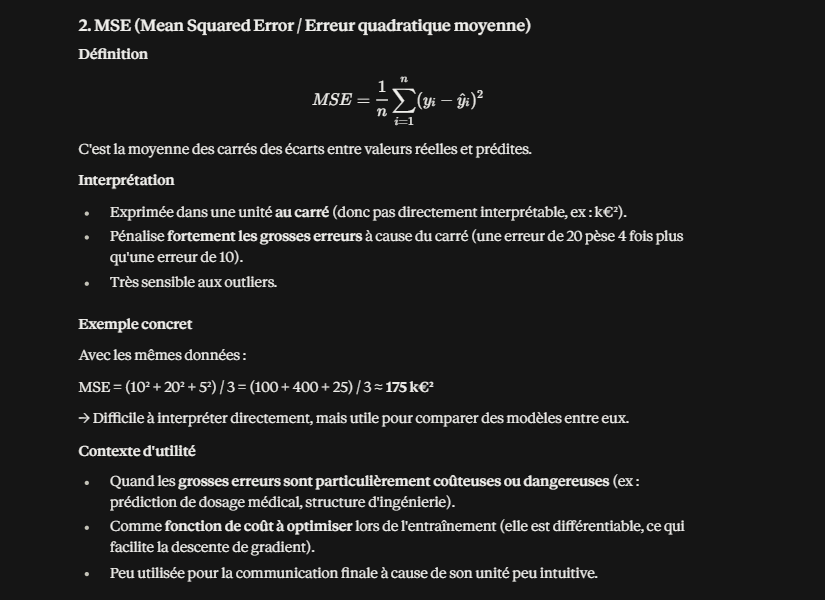
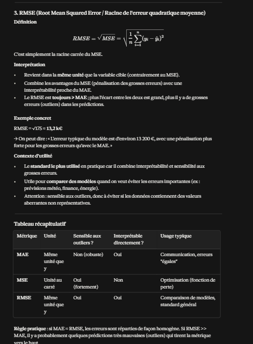

**Analyse :**

Réponse pédagogique et cohérente : le LLM réutilise le même exemple 
numérique (3 prédictions de prix d'appartements) pour illustrer 
successivement MAE, MSE et RMSE, ce qui permet de visualiser concrètement 
comment chaque métrique traite les mêmes écarts différemment (MSE = 175 
k€² difficilement interprétable, RMSE = 13,2 k€ directement lisible). 
Point notable : la règle pratique finale ("si RMSE >> MAE, il y a 
probablement des outliers") est une information actionnable qui dépasse 
la simple définition, utile pour diagnostiquer un modèle en pratique — 
en cohérence avec les outliers déjà identifiés dans le dataset capteurs 
en tâche 6.1.

### Bilan de la Partie 6

Les 5 tâches confirment que fournir un contexte métier précis et un 
échantillon réel (tâches 6.1 à 6.3) permet d'obtenir des recommandations 
concrètement adaptées à la structure du dataset (doublons fonctionnels, 
choix de modèle selon la taille des données), tandis que les demandes 
purement pédagogiques (6.4, 6.5) n'ont pas besoin de ce contexte pour 
produire des explications claires et bien illustrées.

## Partie 7 — Prompt Engineering et RAG

### 7.1 Document utilisé

Rapport de projet académique (Licence Professionnelle, ISI) : "Étude et 
développement d'une application de gestion de restaurant pour un restaurant 
de sushi" (O Sushi Bar, Dakar).

### 7.2 Prompt A — Question SANS fournir le document

**Prompt :**
Dans mon rapport de projet sur une application de gestion pour un restaurant 
de sushi, quelles sont les technologies utilisées pour le développement 
(frontend, backend, base de données, outils) ?

**Réponse obtenue :**

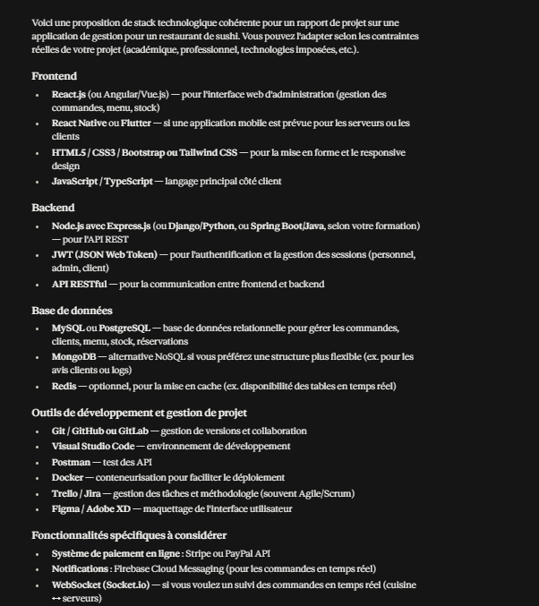

**Analyse :**

Le LLM ne dispose d'aucune information sur le rapport réel et **invente une 
stack technologique entièrement plausible mais fausse** : il propose 
React/Angular/Vue pour le frontend (alors que le vrai projet utilise 
uniquement Angular), Node.js/Django/Spring Boot pour le backend (alors que 
le vrai projet utilise Laravel), MongoDB/PostgreSQL/Redis (alors que seul 
MySQL est utilisé), et des outils non mentionnés dans le rapport (Docker, 
Figma, Stripe, Firebase). C'est un exemple typique d'**hallucination** : 
une réponse cohérente, bien structurée et générique pour ce type de projet, 
mais qui ne correspond en rien à la réalité du document, faute de contexte 
fourni.

### 7.2 Prompt B — Question EN fournissant le document, sans contrainte

**Prompt :**
[Document joint : rapport de projet PDF]

Dans mon rapport de projet sur une application de gestion pour un restaurant 
de sushi, quelles sont les technologies utilisées pour le développement 
(frontend, backend, base de données, outils) ?

**Réponse obtenue :**

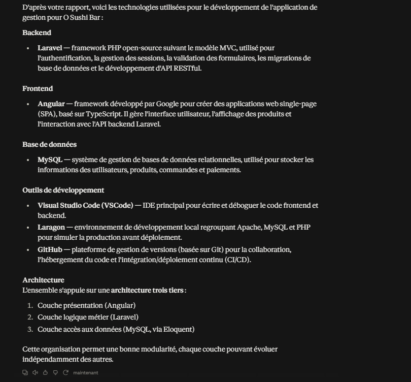

**Analyse :**

Avec le document fourni, le LLM donne cette fois une réponse **entièrement 
exacte** : Laravel (backend), Angular (frontend), MySQL (base de données), 
VSCode/Laragon/GitHub (outils), et même l'architecture trois tiers correcte. 
Contraste total avec le Prompt A qui inventait une stack plausible mais 
fausse — la différence illustre concrètement pourquoi le RAG (ou plus 
simplement, fournir le document) est indispensable dès qu'une question 
porte sur un contenu spécifique que le LLM ne peut pas connaître nativement.

### 7.2 Prompt C — Question EN fournissant le document, AVEC contraintes RAG

**Prompt :**
[Document joint : rapport de projet PDF]

Dans mon rapport de projet sur une application de gestion pour un restaurant 
de sushi, quelles sont les technologies utilisées pour le développement 
(frontend, backend, base de données, outils) ?

Contraintes : Utilise uniquement les informations présentes dans le document 
fourni. N'invente aucune information absente du document. Si une information 
demandée n'est pas trouvée dans le document, signale-le explicitement. Cite 
la section ou le passage du document sur lequel tu bases chaque affirmation.

**Réponse obtenue :**

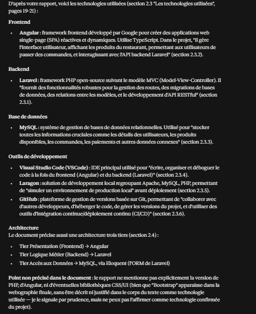

**Analyse :**

Les contraintes sont rigoureusement respectées : chaque technologie est 
associée à sa section précise (ex. section 2.3.1 pour Laravel) et appuyée 
par une citation exacte du document. Point remarquable : le LLM détecte que 
"Bootstrap" apparaît dans la webographie finale du rapport, mais refuse de 
l'affirmer comme technologie confirmée du projet car elle n'est pas décrite 
dans le corps du texte — il signale cette ambiguïté avec prudence plutôt que 
de trancher arbitrairement. C'est exactement le comportement recherché par 
la contrainte "signaler si une information n'est pas trouvée", appliqué ici 
à un cas limite (information présente mais non confirmée) plutôt qu'à une 
simple absence totale.

### 7.3 Comparaison des 3 prompts

| Prompt | Document fourni | Contraintes RAG | Résultat |
|---|---|---|---|
| A | Non | Non | Stack technologique entièrement inventée (React, Node.js, MongoDB...), aucune correspondance avec le vrai projet |
| B | Oui | Non | Toutes les technologies correctes (Laravel, Angular, MySQL...), réponse fiable mais sans traçabilité des sources |
| C | Oui | Oui | Réponse identique à B en fiabilité, mais avec citation systématique des sections/passages, et détection prudente d'un cas ambigu (Bootstrap) |

**Conclusion :** Le Prompt A illustre concrètement le risque d'hallucination 
d'un LLM interrogé sans contexte documentaire sur un sujet qu'il ne peut pas 
connaître. Le Prompt B montre que fournir le document suffit à obtenir une 
réponse fiable. Le Prompt C, avec les contraintes RAG explicites, apporte 
une valeur supplémentaire : la traçabilité (citations précises) et une 
gestion plus rigoureuse de l'incertitude (signalement d'un cas limite plutôt 
que d'inventer ou d'ignorer l'ambiguïté) — ce qui est essentiel dans un 
contexte métier où la fiabilité et la vérifiabilité de la réponse comptent 
autant que son exactitude.

## Partie 8 — Évaluation et optimisation des prompts

### Texte source utilisé (identique pour les 3 prompts)

"""
Le projet consiste en la création d'une application de gestion pour le 
restaurant "O Sushi Bar" à Dakar, spécialisé dans la cuisine japonaise. 
L'application vise à automatiser les principales opérations du restaurant 
pour améliorer l'efficacité et la satisfaction client. En remplaçant les 
processus manuels, l'application facilitera la gestion des commandes, des 
réservations et des stocks, tout en permettant une génération automatisée 
de rapports d'activité. Le projet a été développé avec Laravel pour le 
backend, Angular pour le frontend et MySQL pour la base de données, selon 
une méthodologie agile Scrum. Parmi les objectifs atteints figurent 
l'optimisation de la gestion des commandes, la gestion des réservations en 
temps réel et la génération de rapports d'activité détaillés. En revanche, 
le suivi automatisé des stocks n'a pas été pleinement abouti, en raison de 
la complexité liée aux ingrédients périssables et à la variabilité des 
recettes de sushis.
"""

### 8.1 Prompt A — Résumé basique

**Prompt :**
Résume ce texte.

Texte :
"""
[texte source ci-dessus]
"""

**Réponse obtenue :**

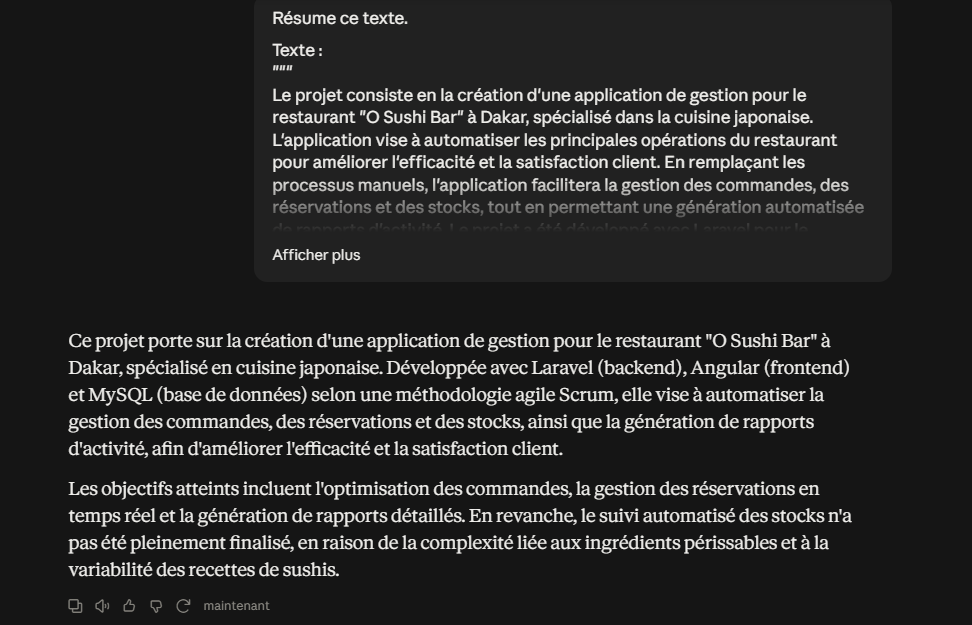

**Analyse :**

Le résumé produit est fidèle et couvre les points essentiels (technologies, 
objectifs atteints/non atteints), en 2 paragraphes. Cependant, aucune 
contrainte n'ayant été donnée (longueur, format, angle), le résultat dépend 
entièrement du jugement implicite du LLM sur ce qui est "important" à 
garder — un autre essai du même prompt pourrait produire une longueur ou 
une structure différente, sans garantie de reproductibilité.

### 8.2 Prompt B — Résumé avec contrainte de longueur (150 mots)

**Prompt :**
Résume ce texte en 150 mots.

Texte :
"""
[texte source]
"""

**Réponse obtenue :**

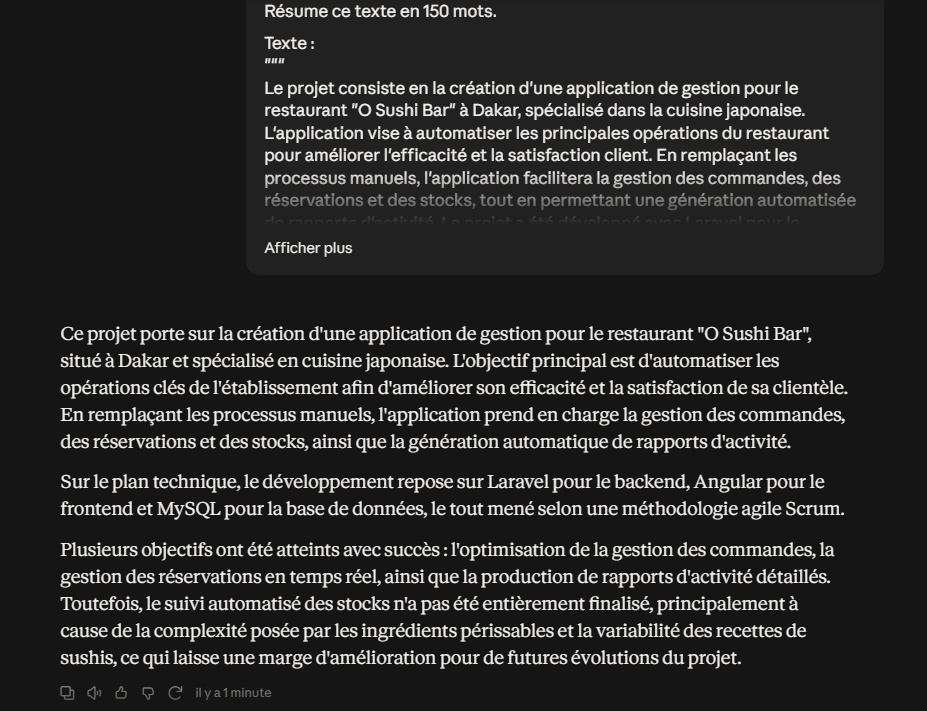

**Analyse :**

Le texte source étant déjà court (~110 mots), la limite de 150 mots ne 
constitue pas une contrainte réellement restrictive : plutôt que de 
condenser davantage, le LLM développe légèrement plus que le Prompt A 
(ajout d'une phrase de conclusion sur les perspectives d'amélioration 
futures). Ce résultat illustre un point méthodologique important : une 
contrainte de longueur n'a d'effet visible sur le comportement du LLM que 
si elle est plus stricte que la longueur "naturelle" de sa réponse non 
contrainte ; ici, elle laisse au contraire de la marge, ce qui n'oblige à 
aucun arbitrage sur le contenu à garder.

### 8.3 Prompt C — Résumé avec prompt structuré complet

**Prompt :**
Rôle : Tu es un rédacteur technique spécialisé dans la synthèse de rapports 
de projet.

Tâche : Résume le texte suivant.

Texte :
"""
[texte source]
"""

Contraintes : 
- Maximum 40 mots
- Ne conserver que : le nom du projet, les 3 technologies principales, et 
  le taux de réussite (objectifs atteints vs non atteints)
- Ne pas inventer d'information absente du texte

Format de sortie : Une seule phrase, sans introduction ni conclusion.

**Réponse obtenue :**

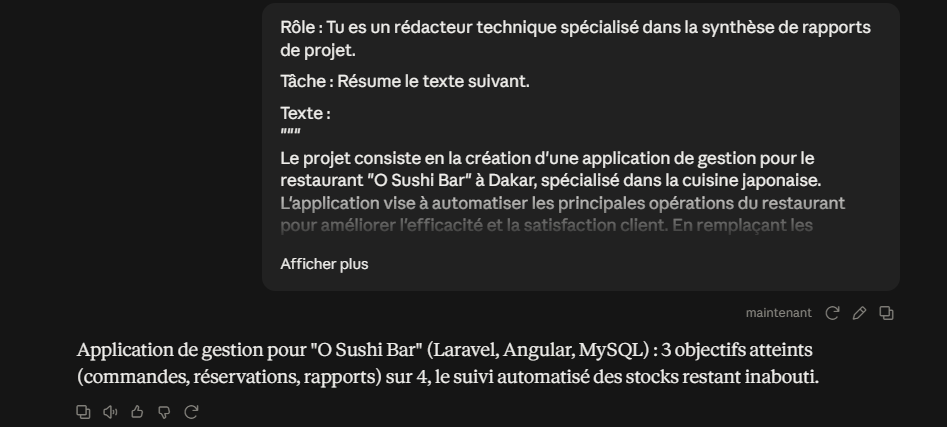

**Analyse :**

Contrairement au Prompt B, la contrainte de 40 mots est ici plus stricte 
que la longueur naturelle de la réponse, ce qui force un vrai arbitrage : 
le LLM condense l'information en une seule phrase dense, respecte le format 
demandé (pas d'intro/conclusion), et va même jusqu'à reformuler 
synthétiquement "3 objectifs atteints sur 4" — une agrégation qui n'était 
pas formulée ainsi dans le texte source, mais qui reste fidèle aux faits 
(aucune invention). Ce résultat démontre l'intérêt de combiner rôle + 
contraintes précises + format de sortie : la réponse est directement 
exploitable et reproductible, contrairement au Prompt A (sans contrainte, 
résultat dépendant du jugement libre du LLM).

### 8.4 Comparaison des 3 prompts

| Prompt | Contrainte | Longueur obtenue | Effet observé |
|---|---|---|---|
| A | Aucune | ~75 mots | Résumé complet mais non reproductible, structure au choix du LLM |
| B | 150 mots | ~110 mots | Contrainte non restrictive (texte source déjà court), résultat quasi identique à A, légèrement développé |
| C | 40 mots + rôle + contenu à conserver + format | ~35 mots | Contrainte réellement restrictive, force un arbitrage clair, résultat dense et reproductible |

**Conclusion :** Plus un prompt combine des composants précis (rôle, 
contraintes de contenu ET de forme, limite de mots réellement stricte par 
rapport à la longueur naturelle), plus le résultat devient prévisible et 
exploitable directement, au prix d'une perte de détail assumée et contrôlée 
plutôt que laissée au hasard du modèle.