# AI Business Assistant — Atelier Prompt Engineering

Ce dépôt présente la réalisation de l'atelier Prompt Engineering : 
construction, test et évaluation de prompts pour un assistant IA métier.

## Partie 1 — Anatomie d'un prompt

**Objectif :** analyser les retours clients d'une entreprise.

### Prompt construit

*Rôle : Tu es un analyste customer insights expérimenté.

Contexte : Une entreprise de e-commerce reçoit régulièrement des avis clients
suite à ses livraisons et son service client.

Tâche : Analyse les avis clients ci-dessous et identifie les tendances 
principales (points positifs récurrents, problèmes récurrents).

Données d'entrée :
"""
1. "Livraison rapide mais l'emballage était abîmé."
2. "Service client très réactif, problème résolu en 10 minutes."
3. "J'ai attendu 3 jours de plus que prévu, aucune communication."
4. "Produit conforme à la description, très satisfait."
5. "Application qui plante souvent au moment du paiement."
"""

Contraintes : Base-toi uniquement sur les avis fournis, ne pas inventer 
d'informations non mentionnées, rester factuel.

Format de sortie : 
- Liste des points positifs récurrents
- Liste des problèmes récurrents
- Une recommandation générale en une phrase*

### Réponse obtenue

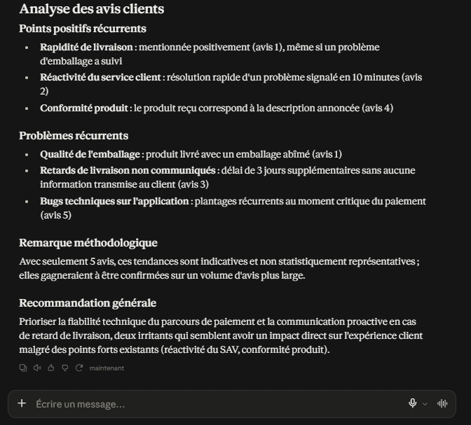

### Analyse

Le LLM a respecté l'ensemble des contraintes du prompt : chaque point cité 
(positif ou négatif) est directement rattaché à un avis précis, sans 
information inventée. Le format demandé (points positifs / problèmes / 
recommandation) est bien suivi. Point notable : le LLM a spontanément 
ajouté une remarque méthodologique sur la faible représentativité 
statistique de l'échantillon (5 avis), ce qui n'était pas explicitement 
demandé mais montre une bonne prise de recul sur la fiabilité de l'analyse.

## Partie 2 — Comparer les techniques de prompting

### 2.1 Zero-shot

**Prompt :**
Classe le commentaire suivant en positif, négatif ou neutre :
"Le service est rapide mais l'application plante régulièrement."

**Réponse obtenue :**

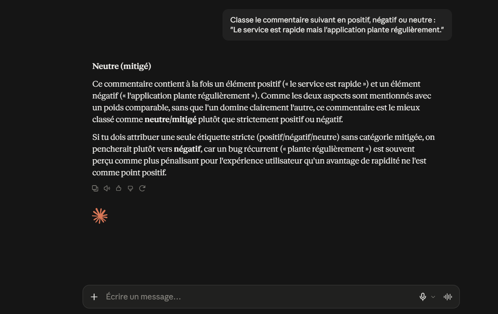

### Analyse 

Le LLM hésite entre deux classes : il propose d'abord "neutre/mitigé" 
(catégorie non prévue dans les 3 classes demandées), avant de préciser 
que s'il doit choisir strictement parmi positif/négatif/neutre, il 
pencherait pour "négatif". Le prompt zero-shot n'imposant aucune 
contrainte de format, le LLM se permet de sortir du cadre des 3 classes 
demandées.

### 2.2 One-shot

**Prompt :**
Voici un exemple de classification :
Commentaire : "Livraison en retard, produit endommagé."
Classe : négatif

Classe maintenant ce commentaire en positif, négatif ou neutre :
"Le service est rapide mais l'application plante régulièrement."

**Réponse obtenue :**

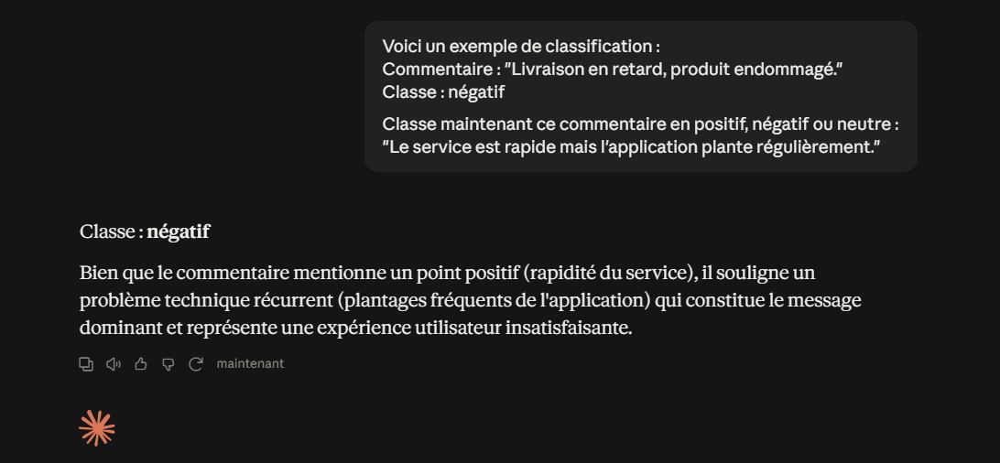

### Analyse

Contrairement au zero-shot qui hésitait entre "neutre/mitigé" et "négatif", 
l'ajout d'un seul exemple suffit à faire trancher le LLM de façon nette 
pour "négatif", en respectant strictement les 3 classes demandées. 
L'exemple fourni (qui associe un problème concret à la classe "négatif") 
semble avoir cadré le format de réponse attendu.

### 2.3 Few-shot

**Prompt :**
Voici des exemples de classification :
Commentaire : "Livraison en retard, produit endommagé." → négatif
Commentaire : "Très satisfait, produit conforme et rapide." → positif
Commentaire : "Produit reçu, rien de particulier à signaler." → neutre

Classe maintenant ce commentaire en positif, négatif ou neutre :
"Le service est rapide mais l'application plante régulièrement."

**Réponse obtenue :**

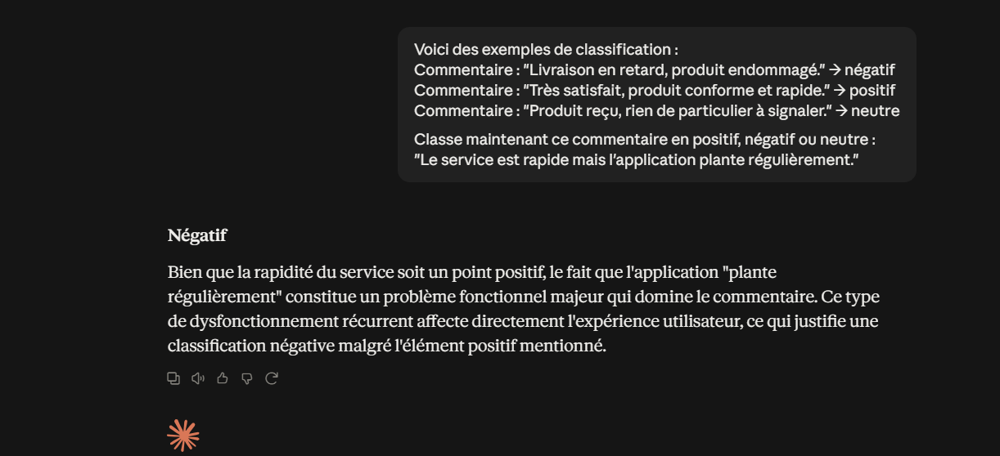

### Analyse

Le few-shot confirme le résultat du one-shot ("négatif"), avec une 
justification quasi identique. L'ajout de deux exemples supplémentaires 
(dont un cas "neutre" et un cas "positif") n'a pas fait varier le résultat 
ni significativement enrichi le raisonnement par rapport au one-shot, ce 
qui suggère qu'un seul exemple bien choisi suffisait déjà à cadrer la 
réponse pour cette tâche de classification simple.

### 2.4 Prompt structuré

**Prompt :**
Rôle : Tu es un système de classification de sentiment client.

Contexte : Une entreprise analyse les commentaires clients pour détecter 
les avis mitigés (contenant à la fois du positif et du négatif).

Tâche : Classe le commentaire suivant en une seule classe parmi : 
positif, négatif, neutre.

Commentaire : "Le service est rapide mais l'application plante régulièrement."

Contraintes : Si le commentaire contient à la fois un point positif et 
un point négatif, choisis la classe qui reflète l'impact principal sur 
l'expérience utilisateur. Justifie brièvement ton choix.

Format de sortie : 
Classe : [positif/négatif/neutre]
Justification : [une phrase]

**Réponse obtenue :**

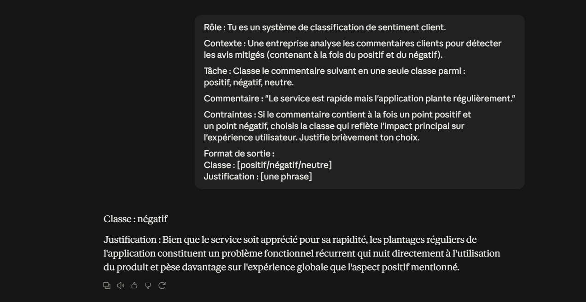

### Analyse 

Le prompt structuré confirme "négatif", avec une justification similaire 
aux deux techniques précédentes, mais cette fois le format de sortie est 
strictement respecté ("Classe : ..." / "Justification : ..."), ce qui 
facilite l'exploitation automatique de la réponse par une application.

### 2.5 Comparaison des 4 techniques

| Technique | Classe obtenue | Respect du format demandé | Qualité de justification |
|---|---|---|---|
| Zero-shot | Hésite entre "neutre/mitigé" et "négatif" | Non (sort du cadre des 3 classes) | Bonne, mais réponse ambiguë |
| One-shot | Négatif | Oui | Nette et directe |
| Few-shot | Négatif | Oui | Similaire au one-shot |
| Prompt structuré | Négatif | Oui, format strict respecté | Nette, format exploitable |

**Conclusion :** le zero-shot est la seule technique à ne pas trancher 
clairement et à sortir du cadre des classes demandées. Dès qu'un exemple 
est fourni (one-shot), le LLM se stabilise sur "négatif" et respecte le 
format — ajouter plus d'exemples (few-shot) n'apporte pas de gain 
supplémentaire sur ce cas précis. Le prompt structuré est le plus fiable 
pour un usage en production, car il impose un format de sortie exploitable 
directement par une application, sans avoir besoin d'exemples.

## Partie 3 — Prompt Engineering et raisonnement

### 3.1 Décomposition du prompt (prompt chaining)

**Prompt initial à décomposer :**
"Analyse ces avis clients et donne-moi les problèmes les plus importants 
ainsi que les recommandations."

Cette tâche complexe est décomposée en 4 prompts séparés et enchaînés, 
où la réponse de chaque étape sert d'entrée à la suivante.

#### Étape 1/4 — Identifier les problèmes

**Prompt :**
Voici des avis clients :
"""
1. "Livraison rapide mais l'emballage était abîmé."
2. "Service client très réactif, problème résolu en 10 minutes."
3. "J'ai attendu 3 jours de plus que prévu, aucune communication."
4. "Produit conforme à la description, très satisfait."
5. "Application qui plante souvent au moment du paiement."
"""
Liste uniquement les problèmes mentionnés (sans les prioriser).

**Réponse obtenue :**

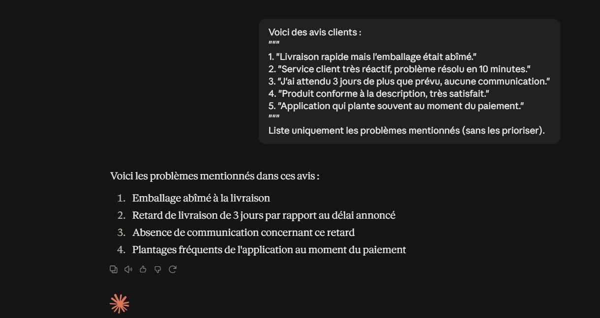

Le LLM identifie 4 problèmes distincts, en séparant même le retard de 
livraison et l'absence de communication (avis 3) en deux problèmes 
séparés, ce qui donne une granularité utile pour la suite de l'analyse.

#### Étape 2/4 — Évaluer l'importance

**Prompt :**
Voici une liste de problèmes identifiés dans des avis clients :
1. Emballage abîmé à la livraison
2. Retard de livraison de 3 jours par rapport au délai annoncé
3. Absence de communication concernant ce retard
4. Plantages fréquents de l'application au moment du paiement

Pour chaque problème, évalue son importance (fréquence d'apparition dans 
les avis, impact potentiel sur l'expérience client).

**Réponse obtenue :**

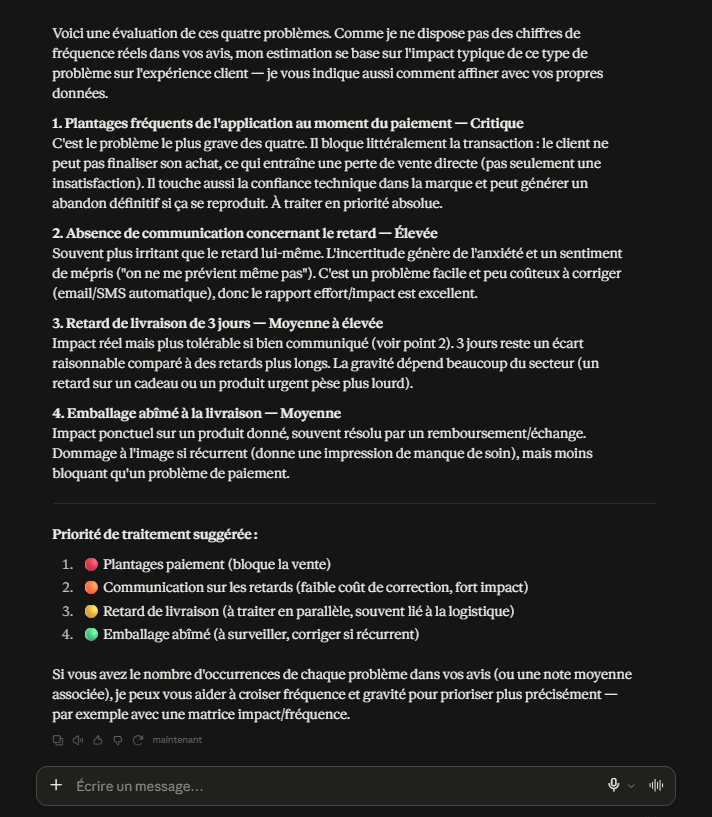

Le LLM évalue chaque problème selon son impact (critique / élevée / 
moyenne à élevée / moyenne) et propose une priorité de traitement. Point 
notable : il signale de lui-même une limite méthodologique (absence de 
données réelles de fréquence dans les avis fournis) et propose une piste 
d'amélioration (croiser fréquence réelle et gravité via une matrice 
impact/fréquence) — une forme de transparence utile sur la fiabilité de 
son évaluation.

#### Étape 3/4 — Prioriser

**Prompt :**
Voici des problèmes avec leur évaluation d'importance :
1. Plantages fréquents de l'application au moment du paiement — Critique
2. Absence de communication concernant le retard — Élevée
3. Retard de livraison de 3 jours — Moyenne à élevée
4. Emballage abîmé à la livraison — Moyenne

Classe ces problèmes du plus important au moins important.

**Réponse obtenue :**

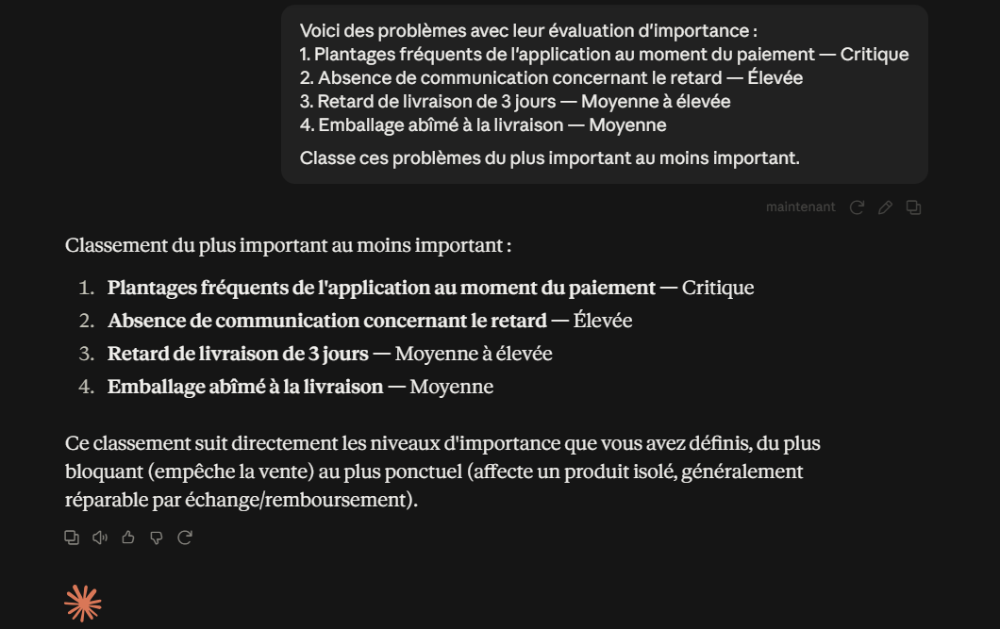

Le LLM confirme le classement déjà induit par les niveaux d'importance 
de l'étape précédente (Critique > Élevée > Moyenne à élevée > Moyenne), 
sans changement d'ordre. Cette étape valide la cohérence du raisonnement 
plutôt que d'apporter une nouvelle analyse.

#### Étape 4/4 — Recommander

**Prompt :**
Voici des problèmes clients classés par importance :
1. Plantages fréquents de l'application au moment du paiement — Critique
2. Absence de communication concernant le retard — Élevée
3. Retard de livraison de 3 jours — Moyenne à élevée
4. Emballage abîmé à la livraison — Moyenne

Pour chaque problème important, propose une recommandation concrète et actionnable.

**Réponse obtenue :**

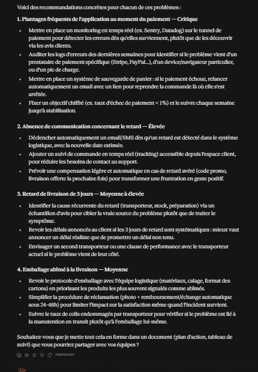

Le LLM propose des recommandations concrètes et actionnables pour chaque 
problème (outils de monitoring, automatisations, indicateurs chiffrés à 
suivre), avec un niveau de détail cohérent avec le niveau de gravité 
(ex : objectif chiffré de taux d'échec pour le problème critique, 
suggestions plus légères pour l'emballage). Il propose même une 
prochaine étape (mise en forme en plan d'action), montrant une bonne 
compréhension de l'usage métier final de cette analyse.

### Bilan de la décomposition (3.1)

Décomposer la tâche en 4 prompts enchaînés permet d'obtenir, à chaque 
étape, une réponse plus ciblée et plus facile à vérifier qu'un unique 
prompt global. Chaque étape s'appuie explicitement sur la précédente, 
ce qui rend le raisonnement traçable et permet de détecter une éventuelle 
erreur avant qu'elle ne se propage aux étapes suivantes (contrairement à 
un prompt unique où toute la logique reste "boîte noire").

### 3.2 Self-check / vérification

**Prompt 1 — Analyse initiale :**
Voici un avis client :
"J'ai commandé un aspirateur robot le 3 mars. Il a mis 10 jours à arriver 
alors que le site annonçait 3 jours. Une fois reçu, il fonctionnait bien 
mais s'est arrêté de charger après une semaine. Le service client m'a 
proposé un remboursement partiel de 20%."

Contraintes : Base-toi uniquement sur les informations présentes dans cet 
avis, ne rajoute aucune information non mentionnée.

Tâche : Résume cet avis en identifiant le problème principal, la cause 
probable et l'action déjà entreprise par l'entreprise.

**Réponse obtenue :**

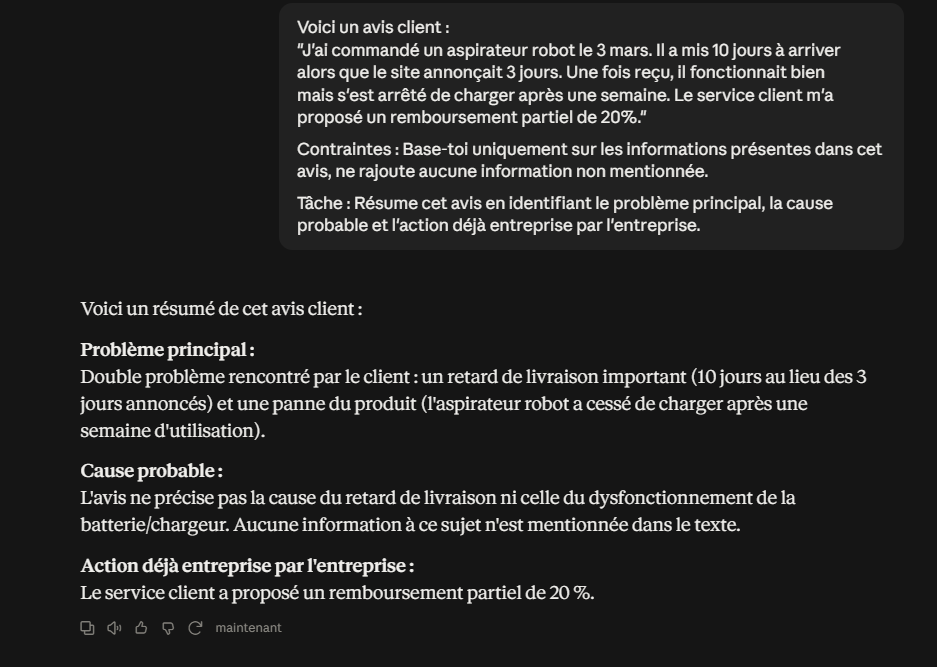

Le LLM identifie correctement les deux problèmes (retard + panne) et 
l'action de l'entreprise (remboursement 20%). Point notable : concernant 
la "cause probable" demandée, il précise honnêtement que l'avis ne 
mentionne aucune cause, plutôt que d'en inventer une — bon respect de la 
contrainte de ne pas ajouter d'information non présente dans le texte.

**Prompt 2 — Vérification (self-check) :**
Vérifie ta réponse précédente en répondant précisément aux points suivants :

1. Contiens-tu des informations non justifiées par l'avis client d'origine ?
2. Y a-t-il des contradictions dans ta réponse ?
3. As-tu omis des informations importantes présentes dans l'avis ?
4. As-tu halluciné une information qui n'était pas dans le texte d'origine ?
5. As-tu bien respecté la contrainte de ne pas ajouter d'information non mentionnée ?

Réponds point par point, en citant précisément ce qui pose problème s'il y en a.

**Réponse obtenue :**

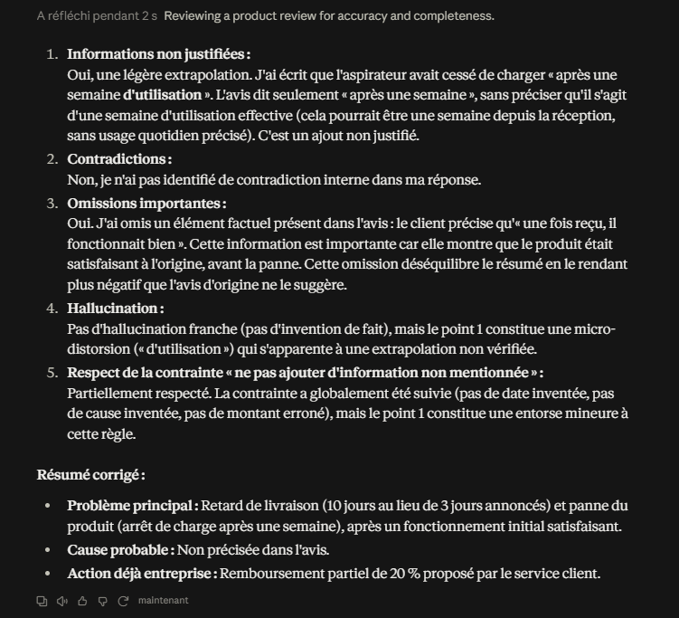

Le self-check révèle deux imperfections réelles dans la réponse initiale :
- une **extrapolation non justifiée** : "après une semaine" transformé en 
  "après une semaine d'utilisation", alors que l'avis ne précise pas s'il 
  s'agit d'usage effectif
- une **omission factuelle** : le fait que le produit "fonctionnait bien" 
  à la réception n'a pas été repris, rendant le résumé plus négatif que 
  l'avis d'origine

Le LLM ne détecte en revanche aucune contradiction interne ni hallucination 
franche, et corrige lui-même son résumé initial en conséquence.

### Bilan du self-check (3.2)

Cette technique permet de détecter des micro-distorsions qu'un simple 
relecture pourrait manquer (l'ajout du mot "d'utilisation" est subtil mais 
change le sens). Le second prompt agit comme un filtre de qualité qui 
améliore la fiabilité de la réponse finale, sans intervention humaine 
entre les deux étapes.

## Partie 4 — Sorties structurées

### 4.1 Génération d'une sortie JSON

**Prompt :**
Rôle : Tu es un système d'analyse de sentiment pour un service client.

Contexte : Voici un commentaire client à analyser :
"Le service est rapide mais l'application plante régulièrement au moment 
du paiement, c'est vraiment frustrant."

Tâche : Analyse ce commentaire et retourne le résultat au format JSON avec 
exactement les champs suivants :
- sentiment : chaîne de caractères, valeur parmi "positif", "negatif", "neutre"
- categorie : chaîne de caractères décrivant le sujet principal du commentaire 
  (ex : "livraison", "paiement", "produit", "service_client")
- urgence : chaîne de caractères, valeur parmi "faible", "moyenne", "elevee"
- probleme : chaîne de caractères décrivant le problème principal identifié
- confiance : nombre décimal entre 0 et 1 représentant ton niveau de confiance 
  dans cette classification

Contraintes : Retourne UNIQUEMENT le JSON, sans texte avant ou après, sans 
balises de code.

Format de sortie attendu (exemple) :
{
  "sentiment": "negatif",
  "categorie": "livraison",
  "urgence": "moyenne",
  "probleme": "Retard de livraison",
  "confiance": 0.91
}

**Réponse obtenue :**

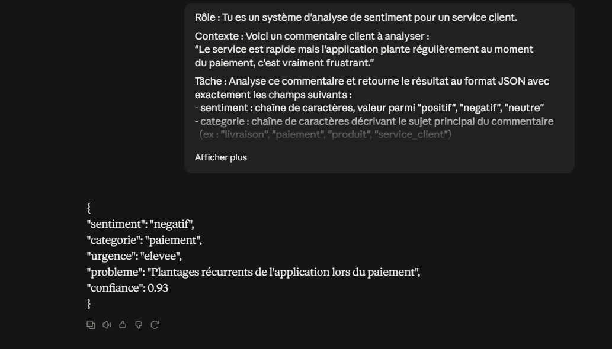

Le LLM retourne un JSON valide et directement exploitable, respectant 
strictement les 5 champs demandés, sans texte parasite avant/après. Les 
valeurs sont cohérentes avec le commentaire : "negatif" et "elevee" sont 
justifiés par le terme "frustrant" et la nature bloquante du problème 
(paiement), avec un score de confiance élevé (0.93).

### 4.2 Validation des règles de sortie

**Prompt :**
Rôle : Tu es un système d'analyse de sentiment pour un service client.

Contexte : Voici un commentaire client à analyser :
"Le service est rapide mais l'application plante régulièrement au moment 
du paiement, c'est vraiment frustrant."

Tâche : Analyse ce commentaire et retourne le résultat au format JSON.

Règles de validation strictes à respecter impérativement :
- Le JSON doit être valide (syntaxe correcte, aucune erreur de parsing)
- Aucune propriété supplémentaire en dehors de : sentiment, categorie, 
  urgence, probleme, confiance
- "sentiment" doit valoir exactement "positif", "negatif" ou "neutre" 
  (aucune autre valeur autorisée)
- "urgence" doit valoir exactement "faible", "moyenne" ou "elevee"
- "confiance" doit être un nombre décimal strictement compris entre 0 et 1
- "categorie" et "probleme" doivent être des chaînes de caractères non vides

Contraintes : Retourne UNIQUEMENT le JSON final, sans texte avant ou après, 
sans balises de code markdown.

**Réponse obtenue :**

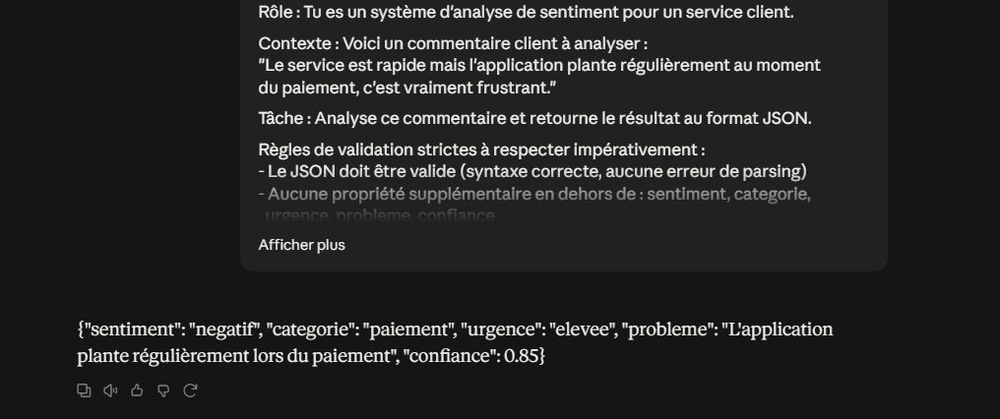

Le JSON produit respecte l'ensemble des règles de validation : syntaxe 
valide, exactement 5 propriétés (aucune superflue), "sentiment" et 
"urgence" utilisent des valeurs autorisées, "confiance" (0.85) est bien 
comprise entre 0 et 1. Le fait d'expliciter les règles de validation 
directement dans le prompt (plutôt que de les vérifier après coup) 
garantit une sortie exploitable sans post-traitement supplémentaire.

### Bilan de la Partie 4

Structurer la sortie en JSON, avec des règles de validation explicites 
dans le prompt, transforme une réponse en texte libre difficilement 
exploitable en une donnée directement utilisable par une application

## Partie 5 — Prompts pour les applications métier

### 5.1 Résumé de document

**Prompt :**
Rôle : Tu es un assistant de synthèse documentaire.

Contexte : Voici un rapport d'activité trimestriel à résumer :
"""
Au cours du dernier trimestre, l'équipe marketing avait pour objectif 
d'augmenter le trafic du site web de 15% et d'améliorer le taux de 
conversion des visiteurs en clients. Pour cela, une nouvelle campagne 
publicitaire a été lancée sur les réseaux sociaux, accompagnée d'une 
refonte de la page d'accueil du site. Les résultats montrent une hausse 
du trafic de 22%, dépassant l'objectif initial, mais le taux de conversion 
n'a progressé que de 2%, en dessous des attentes fixées à 5%. L'analyse 
des données suggère que le nouveau trafic provient majoritairement de 
visiteurs peu qualifiés, attirés par la campagne publicitaire mais peu 
intéressés par un achat immédiat. L'équipe recommande de mieux cibler 
les publicités sur des audiences à plus forte intention d'achat, et de 
simplifier le tunnel de paiement pour réduire l'abandon de panier lors 
du prochain trimestre.
"""

Tâche : Résume ce rapport.

Contraintes : 
- Maximum 250 mots
- Conserver uniquement les informations factuelles présentes dans le texte
- Identifier clairement : les objectifs, les résultats obtenus, les recommandations
- N'inventer aucune information non présente dans le texte

**Réponse obtenue :**

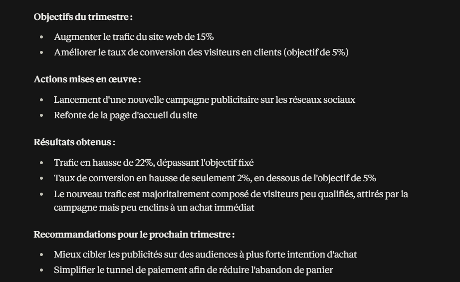

Le résumé respecte toutes les contraintes : structure claire en 4 sections 
(objectifs, actions, résultats, recommandations), aucune information 
inventée, longueur bien inférieure à la limite de 250 mots. Le LLM a même 
ajouté une section "Actions mises en œuvre" non explicitement demandée 
mais pertinente pour la clarté du résumé.

### 5.2 Traduction

**Prompt :**
Rôle : Tu es un traducteur professionnel spécialisé dans les documents 
d'entreprise.

Tâche : Traduis le texte suivant du français vers l'anglais.

Texte à traduire :
"""
La nouvelle version de notre plateforme intègre un système de 
recommandation basé sur l'intelligence artificielle. Ce système analyse 
le comportement de navigation de l'utilisateur en temps réel afin de lui 
proposer des produits pertinents. Les tests internes montrent une 
augmentation de 18% du taux de clic sur les recommandations par rapport 
à l'ancienne version basée sur des règles statiques.
"""

Contraintes :
- Conserver le sens exact du texte d'origine
- Conserver la structure du texte (même nombre de phrases/paragraphes)
- Conserver les termes techniques (ex : "taux de clic", "recommandation") 
  avec leur équivalent anglais standard
- Ne pas résumer le texte
- Ne rajouter aucune information absente du texte d'origine

**Réponse obtenue :**

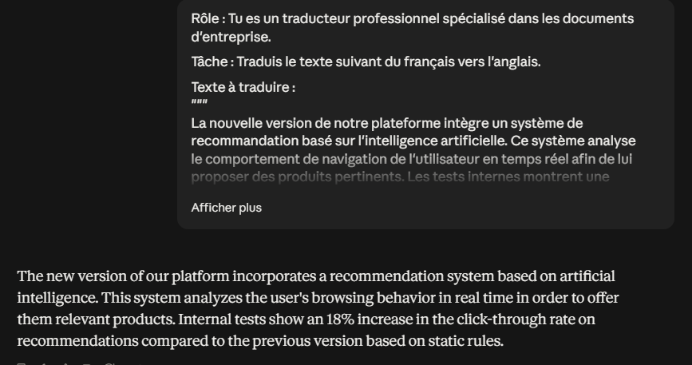

La traduction respecte les contraintes : même nombre de phrases (3), sens 
identique, aucune information ajoutée ou omise. Le terme technique "taux 
de clic" est traduit par son équivalent anglais standard "click-through 
rate", plutôt qu'une traduction littérale, ce qui montre une bonne 
maîtrise terminologique plutôt qu'une traduction mot à mot.

### 5.3 Classification de ticket informatique

**Prompt :**
Rôle : Tu es un système de tri automatique de tickets informatiques.

Tâche : Classe le ticket suivant dans une catégorie parmi : réseau, 
logiciel, matériel, sécurité, accès, autre.

Ticket : "Impossible de me connecter à mon compte depuis ce matin, le 
mot de passe est refusé alors que je suis sûr qu'il est correct. J'ai 
aussi reçu un email disant qu'une tentative de connexion inhabituelle 
a été détectée depuis un autre pays."

Format de sortie : JSON avec les champs suivants uniquement :
- categorie : chaîne de caractères (une valeur parmi la liste donnée)
- justification : chaîne de caractères expliquant brièvement le choix

Contraintes : Retourne uniquement le JSON, sans texte avant ou après.

**Réponse obtenue :**

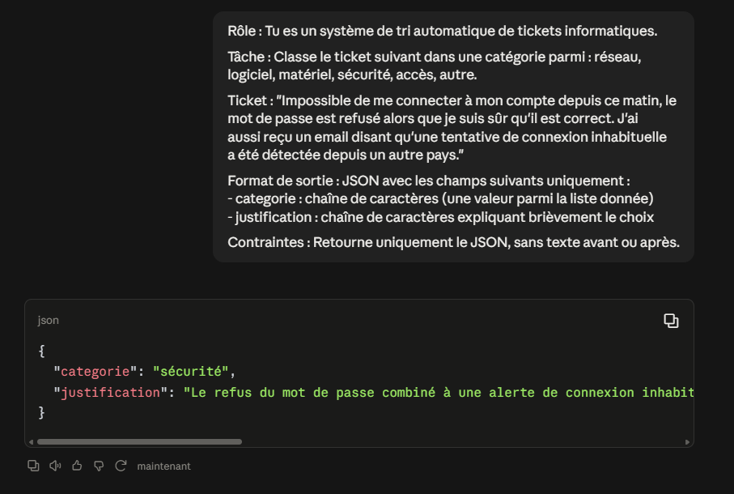

Le LLM classe le ticket en "sécurité" plutôt qu'en "accès", en identifiant 
correctement que la combinaison "mot de passe refusé + alerte de connexion 
inhabituelle" évoque une possible compromission du compte, et non un simple 
problème d'accès classique. JSON valide, respectant strictement les 2 
champs demandés.

### 5.4 Extraction d'informations depuis une facture

**Prompt :**
Rôle : Tu es un système d'extraction de données comptables.

Tâche : Extrais les informations suivantes de la facture ci-dessous : 
numero_facture, date, client, montant_ht, tva, montant_ttc.

Facture :
"""
FACTURE N° FA-2024-0587
Date : 15/03/2024
Client : Société Dupont & Fils
Montant HT : 1 200,00 €
TVA (20%) : 240,00 €
Montant TTC : 1 440,00 €
"""

Format de sortie : Retourne uniquement un JSON valide avec exactement 
ces 6 champs. Si une information est absente de la facture, utilise 
la valeur null (pas de texte, pas de chaîne vide).

**Réponse obtenue :**

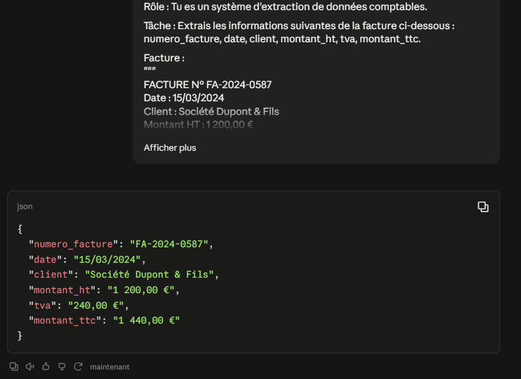

Extraction complète et fidèle des 6 champs demandés, aucune information 
manquante dans cette facture donc aucun `null` nécessaire. Point 
d'amélioration possible : les montants sont retournés en chaîne de 
caractères avec le symbole "€" ("1 200,00 €") plutôt qu'en valeur 
numérique pure — un prompt plus strict pourrait préciser le format 
attendu (ex : nombre décimal sans symbole monétaire) si l'objectif est 
de réutiliser ces valeurs dans des calculs automatisés.